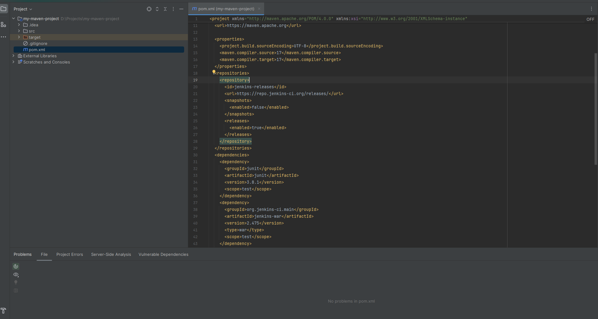
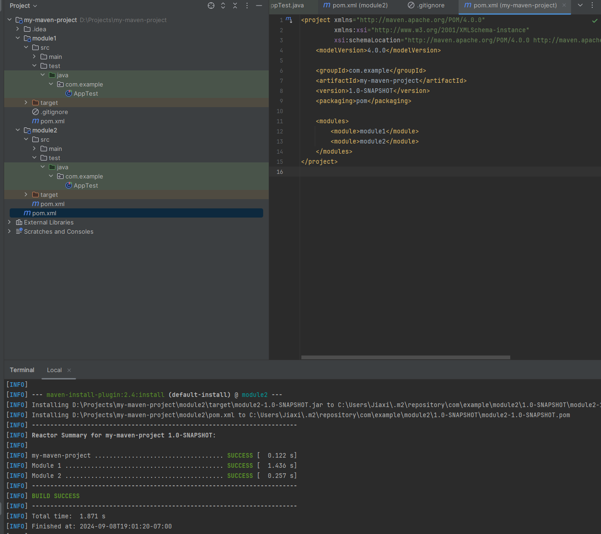

# Maven & Git Assignment - Part 2

## 1. Find at least ONE dependency for each packaging type on https://mvnrepository.com/repos/central

### 1.1 Packaging Type: WAR
```
<dependency>
    <groupId>org.jenkins-ci.main</groupId>
    <artifactId>jenkins-war</artifactId>
    <version>2.475</version>
    <scope>test</scope>
</dependency>
```

### 1.2 Packaging type is jar
```
<dependency>
    <groupId>org.slf4j</groupId>
    <artifactId>slf4j-api</artifactId>
    <version>2.0.16</version>
</dependency>
```


### 1.3 Packaging type is POM
```
<dependency>
    <groupId>fish.focus.uvms.maven</groupId>
    <artifactId>uvms-pom-arquillian-deps</artifactId>
    <version>3.24</version>
    <type>pom</type>
    <scope>test</scope>
</dependency>
```

### Packaging type is other than all above.
```
<dependency>
    <groupId>jakarta.ejb</groupId>
    <artifactId>jakarta.ejb-api</artifactId>
    <version>4.0.1</version>
</dependency>
```

## 2. Explain the difference between war , jar , and POM

**WAR** is used for packaging Java web applications.
**JAR** is used to bundle Java classes and resources into a single file, typically for libraries or standalone applications.
**POM** is an XML file used by Maven to define a project’s dependencies, plugins, and build configurations, but it doesn't contain application code itself.

## 3. Create a maven managed project in IntelliJ Idea, add above dependencies to your project
### 3.1. Resolve all dependency-related errors

### 3.2. Explain how you resolve them
To resolve the issue, I added the following `<repositories>` section to the `pom.xml` file:
```
  <repositories>
    <repository>
      <id>jenkins-releases</id>
      <url>https://repo.jenkins-ci.org/releases/</url>
    </repository>
  </repositories>
```

## 4. Build your project, even if it's empty
### 4.1. Resolve all build-related issues

### 4.2. Install your executable to local maven repository

## 5. Create a new module in your maven project, make 4.2) as a dependency of this module
### 5.1. Resolve all dependency-related issue


## 6. List Maven life cycles in order, compare them.
| Life Cycle       | Purpose                                        | Phases Example                                    |
|------------------|------------------------------------------------|--------------------------------------------------|
| **Clean**        | Cleans the project by removing build artifacts. | `pre-clean`, `clean`, `post-clean`               |
| **Default**      | Handles the complete project build process.     | `compile`, `test`, `package`, `install`, `deploy` |
| **Site**         | Generates project documentation.                | `site`, `post-site`, `site-deploy`               |


## 7.Explain git merge vs git rebase

- **`git merge`** integrates changes from one branch into another by adding a new commit that combines both histories, keeping the branching history visible.
- **`git rebase`** transfers commits from one branch onto another by applying them sequentially, creating a streamlined history without showing where the branches originally diverged.

## 8.Explain Trunk-based developement git branching strategy.
**Trunk-based development** is a method where developers create short-lived feature branches that are merged frequently into the main branch ("trunk"). This approach ensures continuous integration and reduces the risk of complex merge conflicts by avoiding long-running branches

## 9.Explain git reset options.
`git reset` has three main options:
- **`--soft`**: Moves the HEAD to a previous commit but keeps changes in the working directory and staging area.
- **`--mixed`**: Moves the HEAD to a previous commit, keeps changes in the working directory, but clears the staging area.
- **`--hard`**: Moves the HEAD to a previous commit and discards all changes in the working directory and staging area.

